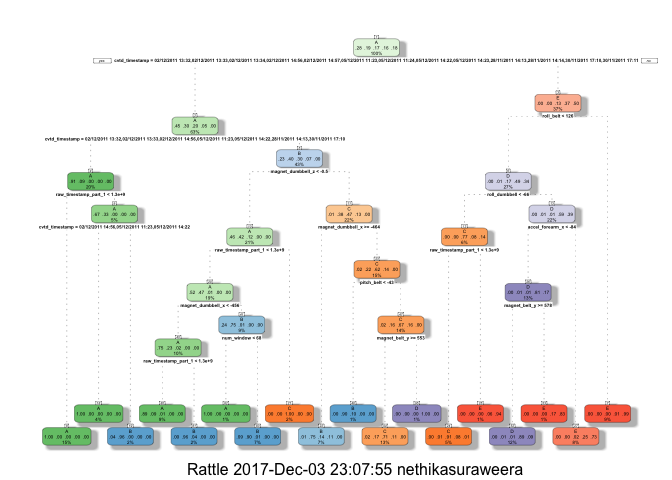
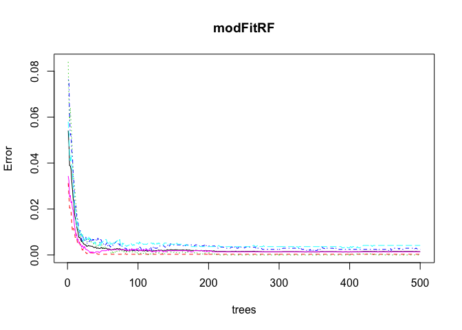
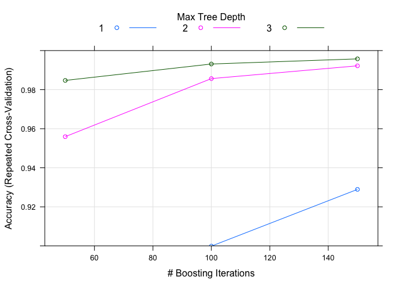

# Practical Machine Learning
Nethika Suraweera  
12/3/2017  

# Background and Introduction

Using devices such as Jawbone Up, Nike FuelBand, and Fitbit it is now possible to collect a large amount of data about personal activity relatively inexpensively. These type of devices are part of the quantified self movement – a group of enthusiasts who take measurements about themselves regularly to improve their health, to find patterns in their behavior, or because they are tech geeks. One thing that people regularly do is quantify how much of a particular activity they do, but they rarely quantify how well they do it. In this project, your goal will be to use data from accelerometers on the belt, forearm, arm, and dumbell of 6 participants. They were asked to perform barbell lifts correctly and incorrectly in 5 different ways. More information is available from the website here: http://groupware.les.inf.puc-rio.br/har 


The goal of this project is to predict the manner in which they did the exercise. This is the “classe” variable in the training set. You may use any of the other variables to predict with. You should create a report describing how you built your model, how you used cross validation, what you think the expected out of sample error is, and why you made the choices you did. You will also use your prediction model to predict 20 different test cases.


# Data Processing


```r
#load libraries
library(caret)
```

```
## Loading required package: lattice
```

```
## Loading required package: ggplot2
```

```r
library(rattle)
```

```
## Rattle: A free graphical interface for data mining with R.
## Version 5.0.14 Copyright (c) 2006-2017 Togaware Pty Ltd.
## Type 'rattle()' to shake, rattle, and roll your data.
```

```r
library(knitr)
library(RColorBrewer)
library(rpart)
library(rpart.plot)
library(randomForest)
```

```
## randomForest 4.6-12
```

```
## Type rfNews() to see new features/changes/bug fixes.
```

```
## 
## Attaching package: 'randomForest'
```

```
## The following object is masked from 'package:ggplot2':
## 
##     margin
```

```r
library(survival)
```

```
## 
## Attaching package: 'survival'
```

```
## The following object is masked from 'package:caret':
## 
##     cluster
```

```r
#load data
set.seed(12345)
trainUrl <- "http://d396qusza40orc.cloudfront.net/predmachlearn/pml-training.csv"
testUrl <- "http://d396qusza40orc.cloudfront.net/predmachlearn/pml-testing.csv"

training <- read.csv(url(trainUrl), na.strings=c("NA","#DIV/0!",""))
testing <- read.csv(url(testUrl), na.strings=c("NA","#DIV/0!",""))


#Partioning the training set into two for cross validation
inTrain <- createDataPartition(training$classe, p=0.6, list=FALSE)
crossTraining <- training[inTrain, ]
crossTesting <- training[-inTrain, ]
#160 cols

#clean data

#Remove NearZeroVariance columns

nzv <- nearZeroVar(crossTraining, saveMetrics=TRUE)
crossTraining <- crossTraining[,nzv$nzv==FALSE]

nzv<- nearZeroVar(crossTesting,saveMetrics=TRUE)
crossTesting <- crossTesting[,nzv$nzv==FALSE]
#132 cols

#Remove columns of the training set that contain any missing values.

crossTraining <- crossTraining[, colSums(is.na(crossTraining)) == 0]
crossTesting <- crossTesting[, colSums(is.na(crossTesting)) == 0]
#59 cols

#remove 1st column
crossTraining <- crossTraining[, -1]
crossTesting <- crossTesting[, -1]
#58 cols
```


# Prediction Algorithms

## Decision Trees


```r
set.seed(12345)
modFitDT <- rpart(classe ~ ., data=crossTraining, method="class")
fancyRpartPlot(modFitDT)
```

<!-- -->

```r
predictionsDT <- predict(modFitDT, crossTesting, type = "class")
cmtree <- confusionMatrix(predictionsDT, crossTesting$classe)
cmtree
```

```
## Confusion Matrix and Statistics
## 
##           Reference
## Prediction    A    B    C    D    E
##          A 2150   60    7    1    0
##          B   61 1260   69   64    0
##          C   21  188 1269  143    4
##          D    0   10   14  857   78
##          E    0    0    9  221 1360
## 
## Overall Statistics
##                                           
##                Accuracy : 0.8789          
##                  95% CI : (0.8715, 0.8861)
##     No Information Rate : 0.2845          
##     P-Value [Acc > NIR] : < 2.2e-16       
##                                           
##                   Kappa : 0.8468          
##  Mcnemar's Test P-Value : NA              
## 
## Statistics by Class:
## 
##                      Class: A Class: B Class: C Class: D Class: E
## Sensitivity            0.9633   0.8300   0.9276   0.6664   0.9431
## Specificity            0.9879   0.9693   0.9450   0.9845   0.9641
## Pos Pred Value         0.9693   0.8666   0.7809   0.8936   0.8553
## Neg Pred Value         0.9854   0.9596   0.9841   0.9377   0.9869
## Prevalence             0.2845   0.1935   0.1744   0.1639   0.1838
## Detection Rate         0.2740   0.1606   0.1617   0.1092   0.1733
## Detection Prevalence   0.2827   0.1853   0.2071   0.1222   0.2027
## Balanced Accuracy      0.9756   0.8997   0.9363   0.8254   0.9536
```

## Random Forests


```r
set.seed(12345)
modFitRF <- randomForest(classe ~ ., data=crossTraining)
predictionRF <- predict(modFitRF, crossTesting, type = "class")
cmrf <- confusionMatrix(predictionRF, crossTesting$classe)
cmrf
```

```
## Confusion Matrix and Statistics
## 
##           Reference
## Prediction    A    B    C    D    E
##          A 2231    2    0    0    0
##          B    1 1516    0    0    0
##          C    0    0 1367    3    0
##          D    0    0    1 1282    1
##          E    0    0    0    1 1441
## 
## Overall Statistics
##                                           
##                Accuracy : 0.9989          
##                  95% CI : (0.9978, 0.9995)
##     No Information Rate : 0.2845          
##     P-Value [Acc > NIR] : < 2.2e-16       
##                                           
##                   Kappa : 0.9985          
##  Mcnemar's Test P-Value : NA              
## 
## Statistics by Class:
## 
##                      Class: A Class: B Class: C Class: D Class: E
## Sensitivity            0.9996   0.9987   0.9993   0.9969   0.9993
## Specificity            0.9996   0.9998   0.9995   0.9997   0.9998
## Pos Pred Value         0.9991   0.9993   0.9978   0.9984   0.9993
## Neg Pred Value         0.9998   0.9997   0.9998   0.9994   0.9998
## Prevalence             0.2845   0.1935   0.1744   0.1639   0.1838
## Detection Rate         0.2843   0.1932   0.1742   0.1634   0.1837
## Detection Prevalence   0.2846   0.1933   0.1746   0.1637   0.1838
## Balanced Accuracy      0.9996   0.9993   0.9994   0.9983   0.9996
```

```r
plot(modFitRF)
```

<!-- -->


## Generalized Boosted Regression


```r
set.seed(12345)
fitControl <- trainControl(method = "repeatedcv",
                           number = 5,
                           repeats = 1)

gbmFit1 <- train(classe ~ ., data=crossTraining, method = "gbm",
                 trControl = fitControl,
                 verbose = FALSE)
```

```
## Loading required package: splines
```

```
## Loading required package: parallel
```

```
## Loaded gbm 2.1.3
```

```r
#gbmFit1 <- train(classe ~ .,
#                       data = crossTraining,
#                       method="gbm", 
#                       verbose = F)


gbmFinMod1 <- gbmFit1$finalModel

gbmPredTest <- predict(gbmFit1, newdata=crossTesting)
gbmAccuracyTest <- confusionMatrix(gbmPredTest, crossTesting$classe)
gbmAccuracyTest
```

```
## Confusion Matrix and Statistics
## 
##           Reference
## Prediction    A    B    C    D    E
##          A 2230    5    0    0    0
##          B    2 1510    0    0    0
##          C    0    2 1362    6    0
##          D    0    1    6 1271    0
##          E    0    0    0    9 1442
## 
## Overall Statistics
##                                           
##                Accuracy : 0.996           
##                  95% CI : (0.9944, 0.9973)
##     No Information Rate : 0.2845          
##     P-Value [Acc > NIR] : < 2.2e-16       
##                                           
##                   Kappa : 0.995           
##  Mcnemar's Test P-Value : NA              
## 
## Statistics by Class:
## 
##                      Class: A Class: B Class: C Class: D Class: E
## Sensitivity            0.9991   0.9947   0.9956   0.9883   1.0000
## Specificity            0.9991   0.9997   0.9988   0.9989   0.9986
## Pos Pred Value         0.9978   0.9987   0.9942   0.9945   0.9938
## Neg Pred Value         0.9996   0.9987   0.9991   0.9977   1.0000
## Prevalence             0.2845   0.1935   0.1744   0.1639   0.1838
## Detection Rate         0.2842   0.1925   0.1736   0.1620   0.1838
## Detection Prevalence   0.2849   0.1927   0.1746   0.1629   0.1849
## Balanced Accuracy      0.9991   0.9972   0.9972   0.9936   0.9993
```

```r
plot(gbmFit1, ylim=c(0.9, 1))
```

<!-- -->

# Predicting Results on the Test Data

Acuracy from different methos are as follows: 

* Random Forests : 99.89 %

* Decision Trees : 87.89 %

* Generalized Boosted Regression : 99.58 %

Therefore we use Random Forests to predic results on the test data.

The expected out-of-sample error is 100-99.89 = 0.11%.


```r
#Clean 'testing' data set.

#Coerce the data into the same type

common <- intersect(names(crossTraining), names(testing)) 
for (p in common) { 
  if (class(crossTraining[[p]]) == "factor") { 
    levels(testing[[p]]) <- levels(crossTraining[[p]]) 
  } 
}

#use Random Forests to predic results on the test data
prediction_test <- predict(modFitRF, testing, type = "class")
prediction_test
```

```
##  1  2  3  4  5  6  7  8  9 10 11 12 13 14 15 16 17 18 19 20 
##  B  A  B  A  A  E  D  B  A  A  B  C  B  A  E  E  A  B  B  B 
## Levels: A B C D E
```

```r
# Write the results to a text file for submission

predDF = data.frame(
  row_id = testing$X,
  prediction = prediction_test)

write.csv(predDF,'predictions.csv')
```


